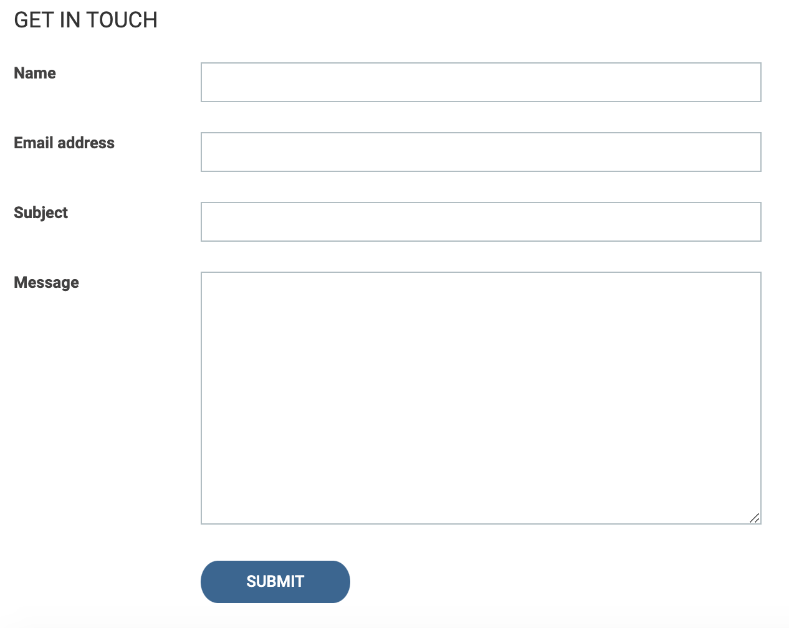

# Student inquiry listing
Manage student inquiries regarding the course.

## Description
This plugin is created using WordPress's built-in WP_List_Table class with CRUD operations (Create, Read, Update, Delete). This plugin is used to manage all the student inquiries.

Any student/visiter will submit the inquiry form for the course in frontend. The admin can see all inquiries submitted to the website. The admin will update the status of inquiry to active once the payment from the student is received for the specific course. The admin will update the course name and amount against the specific inquiry. 

The admin can also send invite either zoom or google meet to the specific students for the specific course.

## Installation
Just Install and Activate It

## FAQ
**Question:** Is there any configuration require for this plugin?

**Answer:** No

##
**Question:** Is all features of this plugin completely free? 

**Answer:** Yes
##

**Question:** Where can I get support?

**Answer:** For support, please contact at saumil.nagariya@gmail.com.
##

**Question:** Where can I report bug?

**Answer:** For reporting related bugs, please contact at saumil.nagariya@gmail.com.
##

## Screenshots
1. Inquiry List Table: 
2. Add an inquiry: 
3. Edit an inquiry: 
4. Send an invite: 
5. Inquiry form: 

## Changelog
### 1.0
* CRUD Operations
* Inquiry Example

## Upgrade Notice
No need to upgrade, you only need to install plugin. This is the initial version of plugin.
